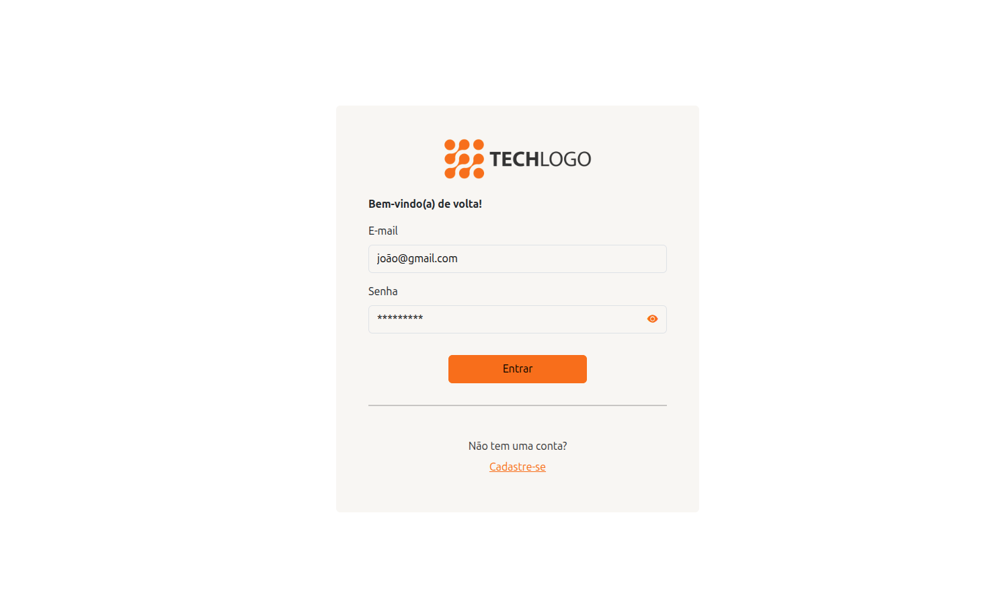
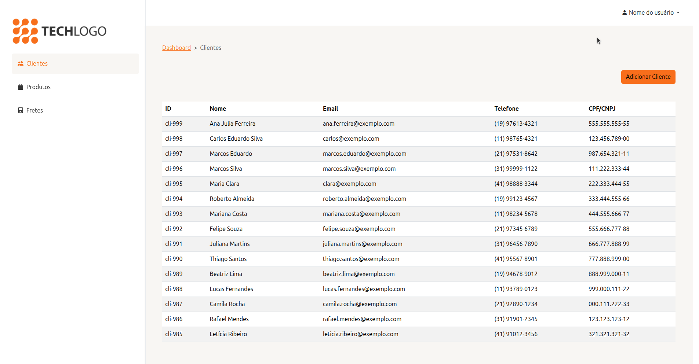
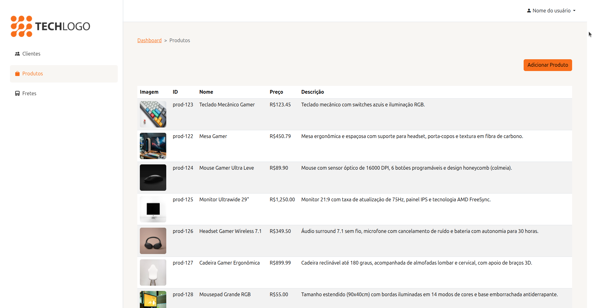

# Freight Tracker Dashboard

Painel administrativo para gestão de clientes, produtos e fretes, construído em Angular moderno (standalone, sem NgModules), seguindo Atomic Design e uma arquitetura em camadas (`core` / `shared` / `features`).

Projeto pessoal de portfólio, focado em arquitetura escalável e boas práticas de Angular: componentes standalone, Signals, Reactive Forms, RxJS (`BehaviorSubject` como estado compartilhado, operadores `map`/`tap`/`catchError`), interceptors e guards funcionais, camada de API tipada sobre um envelope de resposta padronizado, e um design system documentado com Storybook.

## Screenshots

**Login**



**Clientes**



**Produtos**



## Stack

- **Angular 21** — componentes standalone, novo build system (esbuild + Vite)
- **Bootstrap 5** + SCSS (tema customizado)
- **RxJS** — estado compartilhado via `BehaviorSubject`, pipelines com `map`/`tap`/`catchError`
- **Vitest** — testes unitários
- **Storybook** — documentação e desenvolvimento isolado de componentes (Atomic Design)

## Arquitetura

```
src/app/
├── core/        # services e guards transversais (Api, Auth, Storage, Loading, Toast) e interceptors
├── shared/      # design system: atoms, molecules e organisms reutilizados em todo o app
├── features/    # páginas por domínio (auth, dashboard: clients/products/freights),
│                # cada uma com seu próprio service, DTO e mapper
└── layouts/     # shells de rota (auth layout, main layout)
```

Principais decisões:
- **`core` nunca depende de `features`** — services usados por guards/interceptors (ex.: `AuthService`) ficam em `core`, evitando dependência invertida.
- **DTO + mapper por feature** — a API responde em `snake_case`; cada service converte para o modelo de domínio (`camelCase`) na borda, isolando o resto da aplicação do formato bruto da API.
- **`HttpInterceptor` para o token Bearer** — a autenticação é injetada automaticamente em toda requisição, sem cada service precisar conhecer o `StorageService`.

## Como rodar

```bash
npm install
npm start
```

Acesse `http://localhost:4200`.

Para a lista completa de comandos (testes, Storybook, build, geração de código, deploy), veja [docs/comandos.md](docs/comandos.md).

## Testes

```bash
npm test
```

## Storybook

```bash
npx compodoc -p .storybook/tsconfig.doc.json -e json -d .
npm run storybook
```

## Deploy

Publicado via GitHub Pages: **https://gabrielberg4mini.github.io/freight-tracker-dashboard/**
